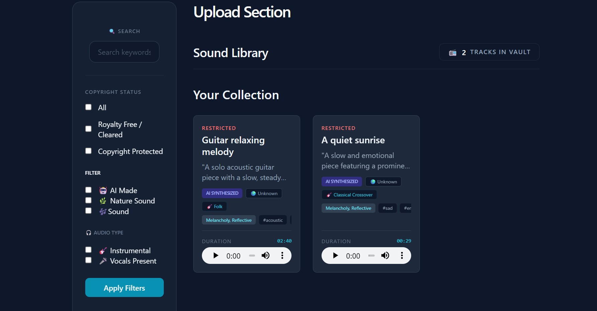

## 🎧 SoundVault 2026: AI-Powered Audio Intelligence

**📄 Overview**

SoundVault is a high-performance audio management system designed to consolidate fragmented media silos into a single, intelligent database. Unlike traditional galleries, SoundVault leverages Google Gemini AI to automatically analyze and tag audio files, creating a fully searchable and categorized sound library.
While my previous work focused on lightweight SQLite deployments, SoundVault 2026 represents a transition to enterprise-grade architecture. This project implements a PostgreSQL RDBMS to manage complex data relationships and high-concurrency traffic, paired with AWS S3 for professional-scale media hosting.
________________________________________

**🌐 Live Demo**

•	**Live URL:** https://soundvault2026-production.up.railway.app

•	**Access Note:** The live demo is configured for Public Read-Only Access. Visitors can browse the intelligent library and view AI-generated insights immediately. Administrative features (Upload/Delete) are restricted behind a secure admin authentication layer.
________________________________________

**🛠️ Tech Stack**

•	**Cloud Infrastructure:** Amazon Web Services (AWS S3 & IAM)

•	**Database:** PostgreSQL (Relational Database Management System)

•	**Backend:** FastAPI (Python 3.14+)

•	**Intelligence:** Google Gemini Multimodal API

•	**Deployment:** Railway (PaaS)

•	**ORM:** SQLAlchemy with Alembic migrations

•	**Authentication:** Custom Admin RBAC with secure Cookie sessions and Bcrypt hashing
________________________________________

**✨ Key Engineering Features**

•	**Scalable Audio Hosting:** Integrated with AWS S3 and configured with custom IAM policies to provide reliable, high-bandwidth storage for audio assets.

•	**Enterprise Data Management:** Implemented PostgreSQL to handle robust relational data, ensuring integrity and performance during concurrent user sessions.

•	**Multimodal AI Analysis:** Utilizes Gemini AI to process audio data, generating descriptive tags and automated summaries to enhance searchability.

•	**Public/Private Permission Logic:** A custom-engineered security layer that serves a "Read-Only" public interface while reserving full CRUD (Create, Read, Update, Delete) capabilities for the authenticated Administrator.

•	**Automated Metadata Ingestion:** Systematically parses file headers to extract timestamps, bitrates, and file types during the upload pipeline.
________________________________________

**⚙️ Local Setup**
1.	**Clone the repository:**
git clone https://github.com/github4eri/SoundVault_2026
2.	**Install dependencies:** pip install -r requirements.txt
3.	**Cloud Configuration:** Ensure your .env file includes your AWS_ACCESS_KEY, AWS_SECRET_KEY, and DATABASE_URL for PostgreSQL.
4.	**Launch Application:** uvicorn main:app --reload
